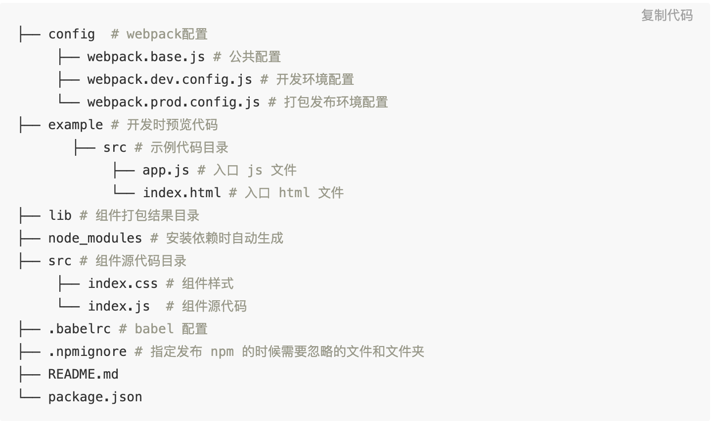

# Simple React Library Template

## File structure



## NPM Publish

#### Component Dev

- Install dependencies：

  ```bash
  npm i
  npm start
  ```

* Package components

  ```bash
  npm run build
  ```

#### Local Test

- Root dir：

  ```bash
  npm link
  cd src/example
  npm link react-simple-library-template
  ```

* Edit example/src/app.js file（replace the one you want to test）：

  ```bash
  // import { DemoButton1 } from '../../src'
  import { DemoButton1 } from 'react-simple-library-template';
  import 'react-simple-library-template/lib/main.min.css'; // css
  ```

* Root dir：

  ```bash
  npm start
  ```

#### Publish to npm

- Check npm config：

  ```bash
  npm config list
  ```

- Change origin：

  ```bash
  npm config set registry http://registry.npmjs.org
  ```

- publish to npm：

  ```bash
  npm run pub
  # same above
  npm build
  npm publish
  ```

- unpublish：

  ```bash
  npm unpublish react-simple-library-template --force # replace with you npm lib name
  ```

### npm install

- Download：

  ```bash
  npm i react-simple-library-template
  ```

- Use：

  ```bash
  # ES6 import
  import { DemoButton1 } from 'react-simple-library-template';
  # if use css.
  import 'react-simple-library-template/lib/main.min.css';
  ```

## Reference

[https://juejin.im/post/5d6760b3e51d453b8b5fa60b#heading-5](https://juejin.im/post/5d6760b3e51d453b8b5fa60b#heading-5)
